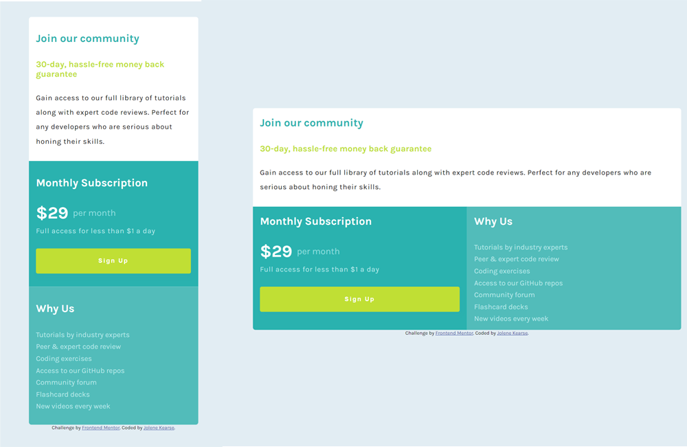

# Frontend Mentor - Single price grid component solution

## Table of contents

- [Overview](#hiya!)
  - [The challenge](#the-challenge)
  - [Screenshot](#screenshot)
  - [Links](#links)
  - [Built with](#built-with)
  - [What I learned](#what-i-learned)
  - [Continued development](#continued-development)
- [Author](#author)

## Hiya! 👋

Thanks for checking out my implementation of this front-end coding challenge, [Frontend Mentor Single price card component](https://www.frontendmentor.io/challenges/single-price-grid-component-5ce41129d0ff452fec5abbbc/hub).

I've been so busy with online classes mainly from [Girl Develop It!](https://girldevelopit.com/) and totally recommend you check them out! 

But it feels so long since I worked on a project of my own. I had a few free hours, and decided to check out challenges I hadn't finished.  I can't emphasize enough how good it felt to be coding again! 🧘‍♀️

### The challenge

Users should be able to:

- View the optimal layout for the component depending on their device's screen size
- See a hover state on desktop for the Sign Up call-to-action

### Screenshot



### Links

- Solution URL: [Github](https://github.com/JoleneKearse/fem-single-price-grid-component)
- Live Site URL: [Frontend Mentor | Single Price Grid Component](https://fem-single-price-grid-component-omega.vercel.app/)

### Built with

- Semantic HTML5 markup
- CSS custom properties
- Flexbox
- Positioning
- Mobile-first workflow

### What I learned

1) I had forgotten how to center something! 🤣

The issue that was hanging me up was setting the following on `html` **and** `body`:

```css
html,
body {
  height: 100vh;
}
body {
  position: relative;
}
.container {
  position: absolute;
  top: 50%;
  left: 50%;
  transform: translate(-50%, -50%);
}
```

### Continued development

I'm continuing a systematic study of **DSA**'s, where I'm being *language agnostic* using **JavaScript**, **Python** & **Elixir**.

## Author

- Github - [JoleneKearse](https://github.com/JoleneKearse)
- Frontend Mentor - [@JoleneKearse](https://www.frontendmentor.io/profile/JoleneKearse)
- Twitter - [@FromJolene](https://twitter.com/FromJolene)
- LinkedIn - [Jolene Kearse](https://www.linkedin.com/in/jolene-kearse-2562ba218/)
